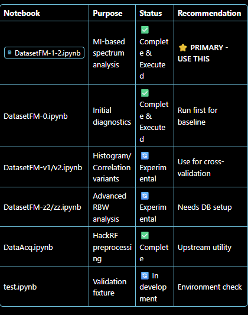

# Main documentation about SDR synchronization and optimal data adquisition 

## GOALS 

- auditate code 

    - Security vulnerability 
    - API authentication  
    - memory leaks 

- define an specific workflow
    - define roles 
    - define responsibilities

- synchronize work

    - use control versions agents (e.g : git)

