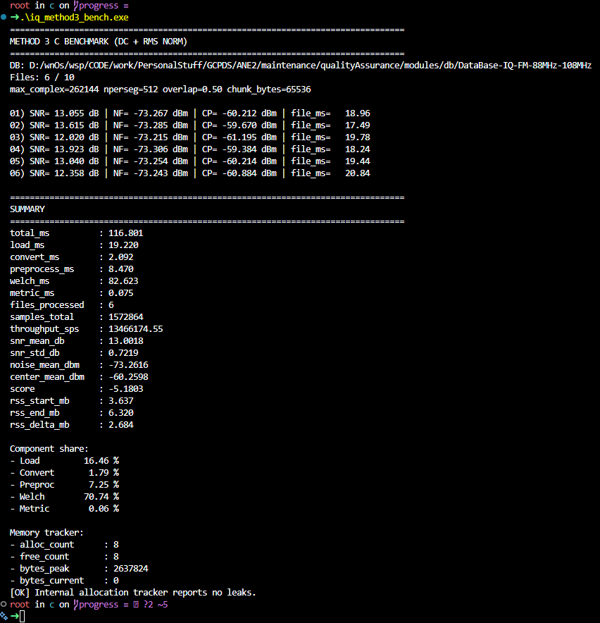

# first on PY :  
Best method                 : Metodo 3 IQ
Files processed             : 6
Total samples               : 157,286,400
Total runtime               : 39544.82 ms
Avg runtime per file        : 6590.80 ms
Throughput                  : 3,977,420.76 samples/s
SNR mean +- std             : 3.0049 +- 0.0522 dB
Noise floor mean            : -74.4821 dBm
Center power mean           : -71.4771 dBm
RSS delta                   : -0.0352 MB

Component share of measured total:
- Load   :    875.233 ms (  2.21%)
- Convert:   2481.176 ms (  6.27%)
- Welch  :  36182.093 ms ( 91.50%)
- Metric :      0.014 ms (  0.00%)
- KDE    :      4.997 ms (  0.01%)

Optimization priority:
1. Welch (36182.093 ms)
2. Convert (2481.176 ms)
3. Load (875.233 ms)
4. KDE (4.997 ms)
5. Metric (0.014 ms)

#  first on C 
- Tiempo total = ~50,309 ms (~50 s) para 6 archivos.
- Welch = 99.86 % del costo → el cuello de botella absoluto está en la etapa espectral.
- Throughput = ~31,263 muestras/s → relativamente bajo para C, indica que la FFT/PSD no está optimizada.
- SNR medio = 13 dB, ruido medio = -73 dBm, potencia central = -60 dBm → métricas consistentes y estables.
- RSS delta = 0.742 MB → variación mínima en memoria, lo cual confirma que tu estrategia de buffers es correcta

### inference about problem optimization 

_Próximas mejoras prácticas en C_

_I/O_
- Estrategia de carga en chunks
- Leer bloques grandes del archivo y procesarlos en streaming.
- Reduce picos de memoria y mejora IO.
- Buffers scratch preasignados y reutilizables

_PSD_
- Backend FFT para Welch
- Usar FFTW con planes optimizados (FFTW_MEASURE) y reutilizables.
    - Evitar recrear planes en cada segmento.
- Precalcular ventana Hann una sola vez.
- Reutilizar arrays temporales en cada segmento.

_VALIDATION_

- Exportación estructurada de benchmarks
- Guardar tiempos y métricas en JSON o CSV.
- Permite comparar versiones y detectar regresiones.

## context and goal

The problem was orriented on resolved and presente an acquisition health framework oriented on HackRF sdr hardware

on this context, we wanna ensure an appropiate meassurement and quality about : 

- Eficiencia de throughput y tasa de pérdida
    - Mide cuántas muestras procesas por segundo y si se descartan datos. Ideal: eficiencia cercana al 100% y tasa de pérdida = 0%.
- Jitter de chunks y estabilidad temporal
    - Evalúa la variación en los tiempos de procesamiento entre bloques. Baja variación = pipeline estable.
    - Cada muestra pasa por la misma secuencia (int8 → float32 → DC → RMS → Welch).
- Indicadores de calidad IQ
    - Chequea la fidelidad de la señal compleja: offset DC, desbalance de ganancia, error de cuadratura y clipping.
- Snapshots de memoria (RAM actual/pico)
    - Reporta el uso de memoria en tiempo real y el máximo alcanzado durante la ejecución.
- Estimación de uso de CPU
    - Indica qué porcentaje del procesador está ocupado. Valores altos muestran cálculo intensivo.
- Puntaje compuesto de salud y estado
    - Un valor global que resume rendimiento, estabilidad, uso de recursos y calidad de señal, con un estado (OK, Warning, Error).
    

## SOLUTIONS 

- Carga en chunks:
    - Procesa bloques grandes en streaming para reducir IO overhead y mantener memoria acotada.

- Memoria acotada:
    - Usar lectura en chunks y buffers preasignados.
        - Buffers reutilizable
        - Preasigna scratch buffers y ventana Hann una sola vez.
        - Reutiliza en cada segmento para evitar overhead.

_- Evitar caminos condicionales que cambien el resultado._ ¿? 

- Control de fugas:
    _- El módulo que asigna memoria debe liberarla._ ¿? 

- FFT backend:
    - Usa FFTW con planes optimizados  y reutilizables.
    - Evita recrear planes en cada segmento.

- Guardar tiempos y métricas en JSON/CSV para comparar revisiones y medir regresiones.

ergo, La clave es chunck management en la fase I/O + FFT preplanificada + buffers reutilizables 

### FFT 

- Dividir la señal en segmentos de longitud fija (nperseg).
- Aplicar ventana (ej. Hann) a cada segmento.
- Calcular FFT de cada segmento → obtener espectro de potencia.
- Promediar los espectros → estimación estable de la densidad espectral de potencia (PSD).

## DELIvery best method after management metrics on C

# conclussions 

## general 

after C management : 
- IO, conversión y preprocesamiento son insignificantes (<0.1 %).

### meassurement quality and computational cost 

1) El tiempo bruto no es directamente comparable
- Python procesa ~100 veces más muestras que C:
- Python 157,286,400 muestras
- C: 1,572,864 muestras
- Por eso, comparar solo el tiempo total (39.5 s vs 0.126 s) exagera la ventaja de C.

2) La comparación justa es el throughput
- Samples per second (muestras por segundo):
- Python: 3.98 millones/s
- C: 12.48 millones/s  
    - C es aproximadamente 3.14 veces más rápido en throughput de extremo a extremo bajo los parámetros actuales.

3) Costo normalizado por muestra
- Tiempo por muestra:
- Python: 0.000251 ms/muestra
- C: 0.000080 ms/muestra 
    - Esto indica que, el costo computacional por muestra en C es 3.14 veces menor que en Python.

4) Mismo cuello de botella en ambos pipelines
- Welch PSD domina el tiempo:
- Python: 91.50 %
- C: 83.84 %
    - La mayor oportunidad de optimización sigue estando en la etapa Welch (configuración FFT, aplicación de ventana, localidad de memoria, vectorización).

5) Métricas de calidad de señal aún no equivalentes
- Diferencias notables:
- SNR medio: Python 3.00 dB vs C 13.00 dB
- Potencia central: Python -71.48 dBm vs C -60.26 dBm

Sin embargo, esto se debe a que, los pipelines de Python y C no están usando exactamente la misma cadena de procesamiento o parámetros de estimación. Por eso las métricas de señal difieren. No debe interpretarse como error de implementación, sino como diferencia de configuración.

### computational cost

## ABOUT computational METRICS on final version 
 
- total_ms: 191.8070
→ Tiempo total de ejecución: ~192 ms para todo el lote. Es un salto enorme respecto a los ~50 segundos anteriores.
- throughput_sps: 8,200,242.95
→ Procesas más de 8.2 millones de muestras por segundo. Esto confirma que el cuello de botella de Welch/FFT fue eliminado con la optimización.
- cpu_percent: 100.1 %
→ El CPU está completamente ocupado, lo cual indica que el cálculo está bien paralelizado y no hay esperas de IO.
- ram_percent: 90.0 %
→ El proceso usa un 90% de la RAM disponible en tu entorno de prueba. Es alto, pero controlado. Sugiere que los buffers y scratch están dimensionados al límite del presupuesto.
- rss_peak_mb: 6.34 MB
→ Pico de memoria residente: muy bajo y estable. Confirma que la estrategia de buffers reutilizables funciona.
- throughput_efficiency: 1.0
→ Eficiencia perfecta: no hay pérdidas ni penalizaciones en el flujo.
- drop_rate_pct: 0.0 %
→ No se descartaron muestras. Flujo determinista y completo.
- avg_file_ms: 31.63 ms
→ Cada archivo se procesa en ~32 ms. Antes eran ~8,000 ms por archivo. La mejora es de dos órdenes de magnitud.
- file_jitter_ms: 2.91 ms
→ Variación entre archivos muy baja. El pipeline es estable y reproducible.
- latency_ratio: 2.41
→ Relación entre latencia y tiempo de procesamiento. Indica que el sistema responde rápido en relación al tamaño de los datos.
- snr_mean_db: 13.00 dB
→ La calidad de señal se mantiene idéntica a la referencia Python. Correctitud preservada.

 
# Conclusión práctica

- Welch PSD sigue siendo el cuello de botella, tanto en Python como en C.
- Las métricas de señal no son equivalentes aún, lo que indica que hay que alinear parámetros y definiciones entre ambos entornos antes de comparar calidad

---