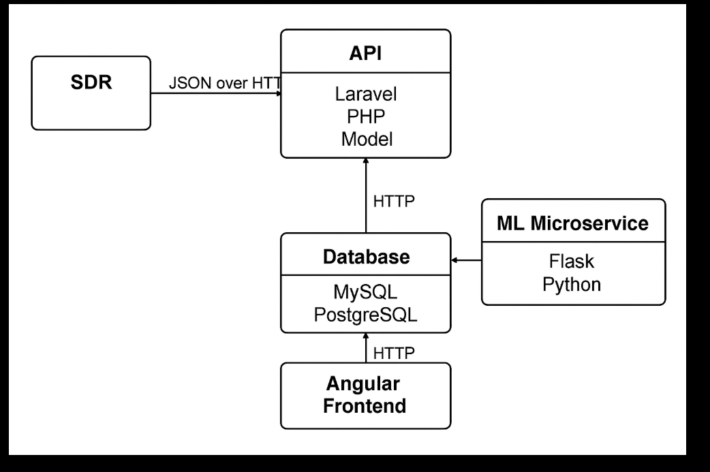
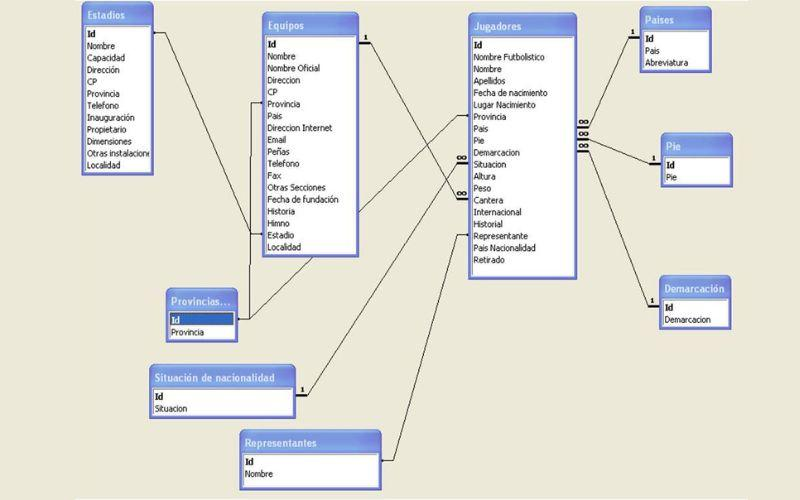

# software notes 

## API deployment


<details> 
  <summary>REQUIREMENTS</summary>

- **FIRST DEFINE REQUIREMENTS:**  


```


# Define Logical Non-Functional Constraints

such as : 

Max latency for detection (e.g., < 2 seconds)

Expected throughput (samples per second)
                
                
_These influence indexing and partitioning decisions._
            
Expected storage growth per day

Retention policy (e.g., raw data 6 months)


```


</details>

## Main goal

_This project seeks to develop an API capable of receiving frequency spectrum data, storing, processing it, and exposing the results to support analysis and monitoring services, designed with future enhancements in mind, particularly the integration of machine learning techniques to enable advanced automation processes._ 

<details>

<summary>Project & system architecture</summary>

We apply the **conceptual → logical → physical** model to guide the development of a distributed frequency monitoring system based on Software Defined Radio (SDR) sensors deployed across Colombia.


The system is designed as a distributed data acquisition and processing architecture:


``` 

SDR Nodes (Colombia) -> massive series time 
↓
Edge Processing Layer (pure C) -> protocol communication TCP/HTTP/JSON ; UDC 
↓
Central API (Laravel/Node,Nest.js/FastAPI,flask,Django/Spring boot[java]) -> API REST (js + angular) + ML 
↓
Database + Storage (PostgreSQL/MySQL) 
↓
Client Applications / Dashboard (Angular)

```





</details>

--- 

<details>

<summary>Conceputal Design</summary>


##  (high-level idea)


Develop an API capable of: (requirements)

- Receiving frequency spectrum data from distributed SDR devices.
- Detecting signals within predefined frequency ranges.
- Storing spectral and metadata information.
- Exposing endpoints for querying frequency activity.
- Supporting analysis and monitoring services.
- `Implement machine learning for data preprocessing, automated detection, and real-time alerting.`

---

###  High-level processing flow:


    - Capture signal → Convert to digital samples → Generate frequency spectrum  
    → Filter by defined frequency range → Detect peaks / anomalies → Send data to API → store , process data and expose results

### software view: 

Core Logical Agents (Conceptual Level for the General System). Each agent is defined with a specific role and clear responsibilities. The following agents have these responsibilities:

- **SDR Agent:** Captures RF signals.
    - SDR produces a continuous stream of raw spectrum data. 
    - each measurment includes a timestamp, frequency, power level and associated node.
- **Processing and storing Agent:** Receive and store data, Performs FFT and filtering. 
- **Communication agent:**  Manage protocol of communication between API and data. 
- **Backend Agent:** Handles storage, memory and communication with an API REST. 
- **Frontend agent:** responsible for data visualization and handling user requests.  

also has those services to implement: (as microservices)

- **Detection Agent:** Identifies signals within target ranges. (as anaylisis motor)
- **Monitoring Agent:** Provides analysis endpoints.
- **Alert Agent:** utilize collected data to drive the detection agent and automatically dispatch alerts via SMS or EMAIL. 
    - The system must allow registering and querying financial transactions in real time, generating alerts when suspicious behaviors are detected, and providing a detailed history so that the security team can analyze possible frauds. Additionally, users must be able to view detailed reports that include metrics and statistics on transactions, highlighting those that present anomalous or unusual patterns.


At this stage, we define *what components exist* and *their responsibilities*, not the implementation details.


#### Database view:   
    
    Entity-Relationship model: 
    We need to use a datababe capable of handling massive time series, this implies a special indexing by time ranges. 

    Main entities:

    - `SDRNode`
    - `Location`
    - `FrequencyRange`
    - `SignalDetection`
    - `SpectrumSample`
    - `User`
    - `Alert`

    Relationships:

    - One `SDRNode` belongs to one `Location`.
    - One `SDRNode` generates many `SpectrumSample`.
    - One `SpectrumSample` may generate many `SignalDetection`.
    - One `FrequencyRange` may match many `SignalDetection`.
    - Users can subscribe to frequency alerts.


  At this stage, we only define _what entities exists_ and _their relationships_, for future ER diagram.


#### API view: 

In this stage, we define how is the system exposed to the outside and how do its consumers interact with it.
This is the formal system interface layer, ie , defines the external and internal communication contracts of the system.


    API interaction categories: 
    - `Ingestion`
        Manage high frequency, low latency , structural validation and message versioning. 
    - `Monitoring`
        Filter by range, node or any other index 
    - `Alert`
    - `Adminstration`
        Register or update info, also manage users. 
    
    Capabilities: 

    - `register nodes`
    - `send data`
    - `consult data` 

_The agents implied on this stage are the communication, backend, frontend agents and microservices._


This means that, the api exposes ingestion, monitoring, alerting, and administrative functionalities while enforcing structured data exchange and versioning.

Here, we only define system capabilites. 

e.g ,  lets implement the _ML microservice_ 


</details>

--- 

<details>

<summary>Logical Design</summary>


## (formal model)


The agents will achieve their responsibilities using the following applications, techniques and supporting technologies.

Here, define a logical architecture style: 

We require:


_Continuous data_

_High availability_

_Detection in seconds_


- **The correct logical architecture is an Event-Driven Microservices Architecture :** 

Define a pipeline, a parallel branch and the API structure: 

**PIPELINE:**

- ` SDR `
→ Ingestion Service
→ Message Broker
→ Storage Service
→ Time-Series Database

Here, we define the logical processing model. 

First, we need to know where does FFT happen. 

_options logically:_

A) On SDR device (edge computing)

B) On Processing Service

C) Agent control on raspberry pi. (as integration layer using C language) 


**Known that the system require detection in seconds and want scalability:**

__Better logical decision:__
FFT at edge → send processed spectrum, in order to reduces backend CPU load dramatically.

_also, its important notice that its necessary implement buffering to prevent data loss._

Now, continue with the 

**PARALLEL BRANCH**

- `MESSAGE BROKER`

→ Detection Service: 

    
→ Alert Service


- `API GATEWAY`

→ Query Service

→ microservices connection 

→ Database connection 

- `FRONT`

→ API Gateway


### Software view: 


    Refinement into structured components:

    - `receive_sdr_data()`
    - `apply_fft()`
    - `filter_frequency_range(min_freq, max_freq)`
    - `detect_signal_power(threshold)`
    - `store_detection()`
    - `generate_alert()`
    - `get_frequency_activity()`
    
  - **SDR Agent:** Captures RF signals and process data using a raspberry-pi (x). 

      Data acquisiton:

      - `SDRs deploys across Colombia.`
      - `Services listened to a specific PORT`

      Data preprocess: 

      - ... C on raspi 
      - `JSON serialized`
      - `Publish to message queue`

  - **Communication agent:**  Manage protocol of communication between API and data using HTTP.

      - `SDR-UDP/TCP communication`

      _scheme and proccess:_ 
      
```
      - SDR → ADQUISITION → BROKER (API-GATEWAY)  → STORAGE (DB) → BROKER → DETECTION → ALERT → API → FRONT <-  


      {
  "version": "1.0",
  "node_id": 12,
  "timestamp": "2026-02-26T21:15:00Z",
  "frequency": 103.5,
  "power": -45.3,
  "metadata": {}
} 

``` 

      - define a standar scheme as input and manage this for the system (JSON serialized).

  - **API:** here, we defined a microservices as architecture of the API. 

    - The system follows a microservices architecture where each component has a specific responsibility and communicates through APIs or real-time channels.
    
    _Microservices:_
      - `MLDetection`
         - Service responsible for analyzing transactions and detecting possible frauds using machine learning. 
      - `alert`
        - Service responsible for notifying via alerts of possible frauds or anomalies in the information.
      - `ingestion`
        - Servicee responsible for receiving raw data streams and submit to broker 
      - `monitoring`
        - Service responsible for tracking the health and performance of the pipeline and microservices 
      - `admin`
        - Responsible for configuration, user management and system orchestration.


#### Database view (relational schema) : 

redirect to a relationated data base management and their implementation, ie , translate conceptual entities into structured tables.

Define _PostgreSQL_ as motor, and storage type partitioned by time range.  

Lets define some tables

_SDR NODE_ 

_LOCATION_

_SPECTRUM SAMPLE (TSA)_

_SIGNAL DETECTION_

_ALERT_
  
**Example relational structure:**

- `SDRNode(id, name, serial_number, location_id, status)`
- `Location(id, city, latitude, longitude)`
- `FrequencyRange(id, min_freq, max_freq, description)`
- `SpectrumSample(id, node_id, timestamp, raw_data_path)`
- `SignalDetection(id, sample_id, range_id, peak_frequency, power_level, timestamp)`
- `User(id, name, email, role)`
- `Alert(id, user_id, range_id, threshold, active)`

**Key elements:**

- Primary and foreign keys (relations) defined.
- 1–N relationships between nodes and samples.
- Many-to-many logic possible between users and monitored ranges.

**Partition:**

- Measurement_2026_x. 

<details>
<summary>ER DIAGRAM</summary>



</details>
 
  Here, we add attributes, primary/foreign keys, and define relations (1–N, N–M).

#### API view (): 


_We define a logical scaling as software strategy_ 

High availability requires:

- **Stateless API services** 

- **Replicated database** 

- **Distributed broker**

- **Horizontal scalling of detection service** 


_Logically define:_

- **Multiple ingestion instances** 

- **Consumer groups for load balancing**

- **Read replicas for monitoring queries** 


_Given the software view and requirements , has some  API Endpoints_ 

(as example):

 **DATA** 

- `POST /api/sdr-data` → Upload SDR raw data
- `GET /api/frequencies` → List monitored frequencies
- `POST /api/frequencies` → Add new frequency


 **ML DETECTION**

- `GET /api/detections` → Retrieve detections
- `POST /api/detections` → Submit new detection
- `GET /api/detections/{range_id}` → Get detection by range


 **NODES**
- `GET /api/nodes` → List nodes
- `POST /api/nodes` → Register new node


 **ALERTS**

- `GET /api/alerts` → Retrieve alerts
- `POST /api/alerts` → Create new alert


_also, the API follow this structure:_

_BACKEND: NODE.js + Express -> ANGULAR_

- **Communication model : (define as layers)** 

    - Transport: `TCP` -> `UDP` 

    - Protocol: `HTTP`

    - Serialization : `JSON`

    - schema : `UniversalDataCommunication` (UDC)

    ` All messages follow a standardized schema, with versioning and validation applied.`
    (reference schema)
    

- **Architectural pattern:**

    - `REST endpoints.`

    - `Event streaming chanel` (kafka-open source distributed event streaming platform for events/services).

    - `WebSocket` for rial time.


LAST BUT NOT LEAST, we define the **microservices architecture** for our system

- **Core microservices:**

    - `Ingest_service`
        - This service is responsible for receiving data generated by the SDR sensors distributed across the monitoring infrastructure.
    - `Storage_service`
        - This service manages the persistence of the collected data.
    - **Fraud detection** 
        - `ML_service`
            - The ML_service is responsible for analyzing incoming data and detecting anomalous or fraudulent activity within the monitored RF spectrum.
            - **Purpose** 
                - This microservice applies machine learning techniques to identify suspicious patterns in the spectrum data, such as:
                    - abnormal transmission patterns

                    - unexpected frequency occupation

                    - interference or unauthorized emissions

                    - traffic patterns that may indicate malicious activity
            - **Technology stack** 
                - .. 
            - **Data processing flow** 
                - `Python -> Flask -> scikit-learn(MLModel)->Libraries` 
            - **microservices communication**
                - .. 
        

        - `Alert_service`
            - The Alert_service is responsible for managing notifications generated by the system when suspicious or anomalous activity is detected.
    - `Auth_service`
        - The Auth_service manages authentication and authorization across the platform.


- **Internal communication:**

    - HTTP REST o SMS (rabbitMQ/KAFKA)

_FRONTEND_ 

- **MODULES**

    - Auth module.

    - Spectrum module.

    - Map module.

    - Alert module.

    - Admin module.

- **ANGULAR SERVICES** 

    - Api service.

    - Auth service.

    - WebSocket service (RT).


</details>

---


<details>
<summary>Phyisical Design</summary>


## ( Implementation ) 


_Provide a real code implementation of the system along with comprehensive process documentation to ensure clarity, reproducibility, and maintainability._


<details>

<summary>API</summary>

Full api has inside: 

all implementation here by layers 

1. system
3. SDR (process using C) 
2. database (postgreSQL )
4. back y front (API REST)
5. API (architecture defined as microservices)
6. Communication (specified protocol)


### Software view: 
  Write the API rest code and documentate. 
  Real code implementation (Python, C++, Angular, APIrest etc.), with modularization, memory optimization, and backend integration.  


#### Database view:  

Store and relationated data management using PostgreSQL.

  Physical deployment in PostgreSQL/MySQL/MongoDB:
  - Creating tables and collections.
  - Adding indexes for fast queries.
  - Security configuration and API communication.
  - Scalability strategies (sharding, replication).


#### API view: 


- _BACKEND AGENT:_ Ensure to handles storage, memory and communication with an API REST. 
- _FRONTEND AGENT:_ Ensure that is capable of visulization and user request management on ANGULAR. 
- _COMMUNICATION AGENT:_ Documentante how manage protocol of communication between API and data, using HTTP.  
- _MICROSERVICES AGENT:_ Ensure that managerial requirements are properly applied and maintained within the system.


</details>

---

<details>
<summary>Hardware Implementation </summary>


SDR nodes implementation and so
here describe some notes about hardware implementation. (could go into the guide system model (intro))


</details>


full implementation details 

put here the API code deployment : 

<details>
<summary>CODE</summary>

1. First we preprare the environment for manage and deploy the system 

   - WSL2 -> local environment
   - PostgreSQL -> DB
   - Node 
   - Angular 
   - Git
   - Docker 

2. Continue with the database implementation 

   - scheme 
   - tables
   - partitions 
   - indices 
   - massive data ingestion 
   
   _Proceed with the test_ 
   
   - insert 1M registers
   - meassure time and request per range 

3. Backend 
   - create Express project
   - connect PostgreSQL
   - POST/Meassurments implement 
   - GET implementation per range 
   - JSON validated 

   _TEST_

   - unit test  
   - load test 

4. Frontend
   - create angular project 
   - API connection 
   - show table
   - show spectrum diag
   - correlation matrix 

   _TEST_ 

   - Manual test
   - Integration test

5. ML integration 
   - batch data extracted 
   - train model 
   - integrate microservice
   - generate automatic alerts 
   - send info via SMS/MAIL 

  
</details>

---

</details>

---


##  Finalization conditions 

<details>
<summary>prototype</summary>


The task is considered complete when:
- At least 10 SDR nodes are deployed and transmitting data.
- Frequency detection within predefined ranges is validated.
- API endpoints return accurate and structured data.
- Database integrity constraints are verified.
- Alert mechanism is functional.
- Documentation includes:
  - ER diagram.
  - Architecture diagram.
  - API endpoint specification.
  - Deployment instructions.
- Load testing confirms the system supports concurrent node transmissions.


</details>

---

## Deployment and proofs. 


...


---