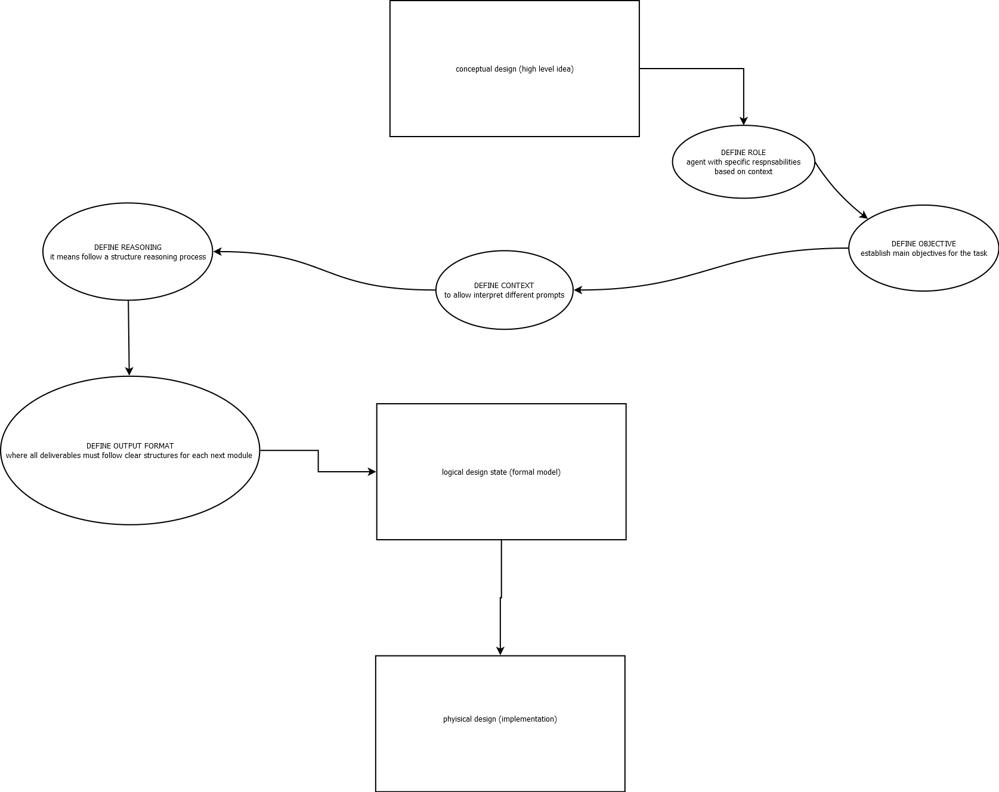

# Multiagent for chatbots management

This project seeks to develop a multiagente system capable of managing different chatbots, coordinating its answers according to:

- _ROLE_
- _OBJECTIVE_
- _CONTEXT_
- _REASONING_

---

# Divide the project into different roles according to the progress of the project, this generate a specific structure on the project design :

The methodology follows structured steps to ensure clarity, modularity, and robustness:

1. Well-crafted prompts
2. Concrete illustrations (examples of use)
3. Step by step process
4. Roles assigned to each agent
5. Reducing hallucinations

---

## 1. Continue with the project structure

We apply the **conceptual → logical → physical** model to guide the development of the system:

### 1.1. Conceptual Design (high-level idea)

- **Software view:**  
  Step-by-step plan of the algorithm (like pseudocode).  
  Example: "Receive input → Assign agent → Analyze context → Generate coordinated response".

- **Database view:**  
  Entity-Relationship model:

  - `User`
  - `Audio`
  - `Spectrogram`
  - `Chatbot`
  - `Agent` (Coordinator, Interpreter, Backend, Audio)

  At this stage, we only define _what exists_ and _their relationships_, not the implementation.

---
|
### 1.2. Logical Design (formal model)

- **Software view:**  
  Pseudocode refined into structures closer to code.  
  Example: functions for `assign_role()`, `analyze_context()`, `process_audio()`, `reduce_hallucination()`.

- **Database view:**  
  Conversion to relational/logical schema:

  - `User(id, name, role)`
  - `Audio(id, user_id, raw_data, timestamp)`
  - `Spectrogram(id, audio_id, frequencies, intervals)`
  - `Chatbot(id, type, objective)`
  - `Agent(id, role, task, status)`

  Here, we add attributes, primary/foreign keys, and define relations (1–N, N–M).

---

### 1.3. Physical Design (implementation)

- **Software view:**  
  Real code implementation (Python, C++, etc.), with modularization, memory optimization, and backend integration.  
  Example: APIs for chatbot coordination, signal processing, and reasoning.

- **Database view:**  
  Physical deployment in PostgreSQL/MySQL/MongoDB:
  - Creating tables and collections.
  - Adding indexes for fast queries.
  - Security configuration and API communication.
  - Scalability strategies (sharding, replication).

---

## 2. Task list for each module/state of design:

### 2.1. ROLE

Define agents with specific responsibilities:

- _Coordinating agent:_ Assign the role and select the appropriate chatbot.

- _Interpretation agent:_ Analyze the context of the petition.

- _Audio agent:_ processes signals (frequency, spectrum, intervals).

- _BACKEND AGENT:_ Handles storage, memory and communication with API.

---

## 2.2. OBJECTIVE

Establish the main objectives for the multiagent system:

- Integrate multiple chatbots into a single coordinated system.
- Provide consistent responses regardless of the model’s internal differences.
- Ensure context-awareness and adaptability to user requests.
- Incorporate audio signal analysis as part of multimodal input processing.
- Maintain modularity to allow scaling and future improvements.

---

## 2.3. CONTEXT

The multiagent system must consider:

- Different chatbots interpret prompts differently depending on context, role, and objectives.
- Need for a mechanism that verifies coherence and alignment of responses.
- ¿??Research environment requirement: project deliverables must be clear, traceable, and organized for the research group led by Professor Germán Castellanos.
- Connection with backend development in **C language** for posterior tasks.

---

## 2.4. REASONING

The reasoning process each agent should follow:

- **Verification**: Validate that proposed responses are coherent, feasible, and aligned with user intent.
- **Cross-checking**: Compare chatbot outputs to select the most consistent and context-appropriate.
- **Optimization**: Focus on clarity, conciseness, and practical value of responses.
- **Iterative feedback**: Improve outputs through interaction cycles between agents.

---

## 2.5. OUTPUT FORMAT

All deliverables must follow clear structures:

- **Tables in Markdown** for summarizing methods, comparisons, and experimental results.
- **Diagrams** (e.g., architecture, data flow, signal processing) embedded into the README or linked from `/docs/diagrams/`.
- **Code blocks** for implementation examples in Python and C.
- **Reports** organized in `/docs/reports/`.

---

## 2.6. FINALIZATION CONDITIONS

The task is considered complete when:

- At least three unique chatbot agents are integrated and functional.
- Context analysis (text + audio) is validated through test cases.
- Documentation in Markdown is complete, including diagrams and conceptual models.
- Backend modularity is demonstrated (storage, API communication, memory usage).

---
