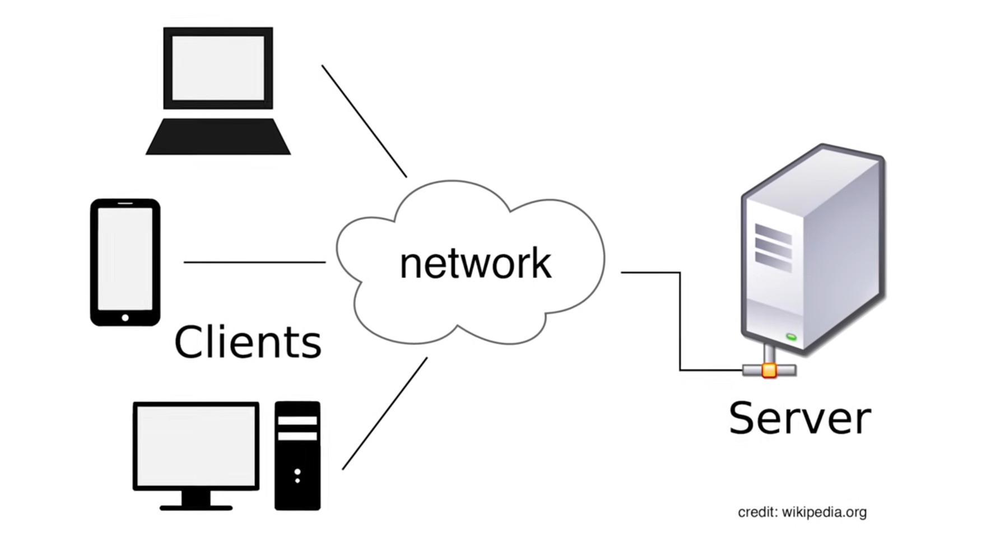

# HOMELAB

## what it is 

a homelab is a system architecture (SANDBOX) basd on hardware to deploy a server and made as host. Storage multiple data and make it accessible to anyone at any time. 
//

is a self-hosted environment where a user has the flexibility to deploy services, applications and networking features with limited dependence on external tools

## architecture

how to manage their architecture dependes on my goal (need or want)

### functionality

    - storage many data 
    - have sufficient COMPUTATIONAL PROCESS
    - have a server to makeit accessible and personalizable 

    - host and storage data in order to design and deploy a LLM. 
        - kubernetes, web server, game server, dockers, virtualization , etc 

#### some idea : 

 run a PERSONAL SERVER FOR AN PERSONAL API development 

### reliability

    - host services is important 
        - high avaliability
        - clusters
        - battery backups for longer maintenance 
    
### cost
    - spend the less amount of money in order to get the functionality that i want achieve. 

## parts of the homelab

    - compute 
    - storage
    - networking
    - place (rack or something)

## how to start

    - OLD COMPUTER
    - RASPBERRY PI 
    - DEDICATED SERVER (NAAS or ZFS or ENTERPRISE GEAR )

        

## for FREE

### OLD COMPUTER

- GET AND OLD COMPUTER CAPABLE TO RUNNING A WORKLOAD as:
    - linux 
    - windows (learn about filesharing and active directory or networking )
 
### STORAGE 
    - First get the sotrage capactie depends on necessities.
     - NAS hardware to buy 
     - repurpose machines 
        - install UNRAID , jelly find
        - buy 12TB WD HDDs
### UPS 
    - energy backup (optionally)

### NETWORKING
    - Install proxmox in order to deploy many systems (Virtual Machines)
    - buy a personal router for access points  
        - RUN OPEN WRT into an PERSONAL ROUTER and not use their software 
    - buy a peersonal 2.5 Gb SWITCH 

### another COMPUTER

in order to have services or containers or VMs running in parallel but not in my HOMELAB consuming my resources 

- BUY A MS01 with the intel core i9 13900H processor for START with a basis 
    - another option is a THIN CLIENT. 

- BUY A NAAS. 

### JETKVM hardware TOOL 

- think on buy one  

## on linux

 _software that i need to start_

    - a server operating system
        - proxmox VE, Unraid, trueNAS
        - ZimaOS (GREAT BEGGINER OPERATING SYSTEM) 
            - download ISO, create a rootable usb, boot the menu, then install on the process and once its installed and then habilitate the SERVER with the IP address displayed, on the UI ZimaOS web 
                1. Set up a storage 
                    - storage configuration and create one 
                         - set up a combined use 
                            - RAID 5 (sigle drive as parity)
                            - RAID 1 (just mirroring) 
                                - use raid 5 and select the disk 
                        -   then make it my disk accessible VIA LOCAL NETWORK FOR ALL the devices. 
                            - into files app, goes to main-sotrage cratetd, and then to shared. into the manage shared, i got a link to share , and on adifferent pc, i can obtain the access with this URL inside my archivesfiles
                2. install apps using docker 

                3. Also can install VMs 
        - INSTALL Open Media Vault USING a RASPBERRY PI and the storage device (HSD or SSD)
            - then, connect the drive into my device( raspi) and the computer (device) into my router
                - after this, configurate on OPEN MEDIA VAULT. 

                    - resource : https://pimylifeup.com/raspberry-pi-openmediavault/ 

### another setup 
    - use NAS via  NAS (Network attached storage) using trueNAS. 
        - set up storage and data available 
            - docker (dockge or PORTAINER) or KUBERNETES
            - MEMOS for notes
            - bookmarks for link pages
            - uptime kuma for management containers 
                - to access :   
                    - glance homepage. 

                - tailscale for network access 
