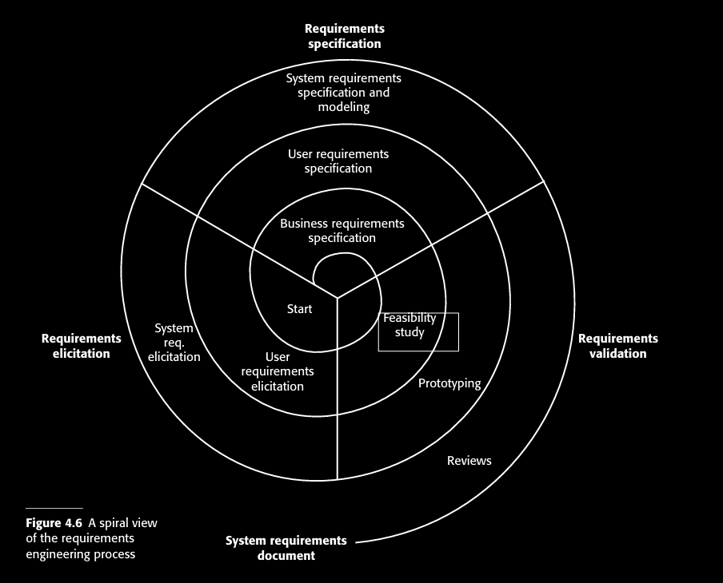

# software notes 

## API deploy 


<details> 
  <summary>REQUIREMENTS</summary>

- **FIRST DEFINE REQUIREMENTS:**  


</details>


- **main goal:**  
This project seeks to develop an API capable of receiving frequency spectrum data, storing, processing it, and exposing the results to support analysis and monitoring services, designed with future enhancements in mind, particularly the integration of machine learning techniques to enable advanced automation processes.

### project structure & system architecture 


We apply the **conceptual → logical → physical** model to guide the development of a distributed frequency monitoring system based on Software Defined Radio (SDR) sensors deployed across Colombia.


The system is designed as a distributed data acquisition and processing architecture:


``` 

SDR Nodes (Colombia) -> massive series time 
↓
Edge Processing Layer (pure C) -> protocol communication TCP/HTTP/JSON ; UDC 
↓
Central API (Laravel/Node,Nest.js/FastAPI,flask,Django/Spring boot[java]) -> API REST (js + angular) + ML 
↓
Database + Storage (PostgreSQL/MySQL) 
↓
Client Applications / Dashboard (Angular)

```


## conceptual design (high-level idea)


Develop an API capable of: (requirements)

- Receiving frequency spectrum data from distributed SDR devices.
- Detecting signals within predefined frequency ranges.
- Storing spectral and metadata information.
- Exposing endpoints for querying frequency activity.
- Supporting analysis and monitoring services.
- `Implement machine learning for data preprocessing, automated detection, and real-time alerting.`

---

###  High-level processing flow:


    - Capture signal → Convert to digital samples → Generate frequency spectrum  
    → Filter by defined frequency range → Detect peaks / anomalies → Send data to API → store , process data and expose results

### software view: 

Core Logical Agents (Conceptual Level for the General System). Each agent is defined with a specific role and clear responsibilities. The following agents have these responsibilities:

- **SDR Agent:** Captures RF signals.
    - SDR produces a continuous stream of raw spectrum data. 
    - each measurment includes a timestamp, frequency, power level and associated node.
- **Communication agent:**  Manage protocol of communication between API and data. 
- **Processing and storing Agent:** Receive and store data, Performs FFT and filtering. 
- **Backend Agent:** Handles storage, memory and communication with an API REST. 
- **Frontend agent:** responsible for data visualization and handling user requests.  

also has those services to implement: (as microservices)

- **Detection Agent:** Identifies signals within target ranges. (as anaylisis motor)
- **Monitoring Agent:** Provides analysis endpoints.

- **Alert Agent:** utilize collected data to drive the detection agent and automatically dispatch alerts via SMS or EMAIL. 


At this stage, we define *what components exist* and *their responsibilities*, not the implementation details.


#### Database view:   
    
    Entity-Relationship model: 
    We need to use a datababe capable of handling massive time series, this implies a special indexing by time ranges. 

    Main entities:

    - `SDRNode`
    - `Location`
    - `FrequencyRange`
    - `SignalDetection`
    - `SpectrumSample`
    - `User`
    - `Alert`

    Relationships:

    - One `SDRNode` belongs to one `Location`.
    - One `SDRNode` generates many `SpectrumSample`.
    - One `SpectrumSample` may generate many `SignalDetection`.
    - One `FrequencyRange` may match many `SignalDetection`.
    - Users can subscribe to frequency alerts.


  At this stage, we only define _what entities exists_ and _their relationships_, for future ER diagram.


#### API view: 

In this stage, we define how is the system exposed to the outside and how do its consumers interact with it.
This is the formal system interface layer, ie , defines the external and internal communication contracts of the system.


    API interaction categories: 
    - `Ingestion API`
        Manage high frequency, low latency , structural validation and message versioning. 
    - `Monitoring`
        Filter by range, node or any other index 
    - `Alert`
    - `Adminstration`
        Register or update info, also manage users. 
    
    Capabilities: 

    - `register nodes`
    - `send data`
    - `consult data` 

_The agents implied on this stage are the communication, backend, frontend agents and microservices._


This means that, the api exposes ingestion, monitoring, alerting, and administrative functionalities while enforcing structured data exchange and versioning.

Here, we only define system capabilites. 


--- 

## logical design (formal model) 


The agents will achieve their responsibilities using the following applications, techniques and supporting technologies.

Here, define a logical architecture style: 


```

🔷 STEP 2 — Define Logical Architecture Style

Because you require:

Continuous data

High availability

Detection in seconds

The correct logical architecture is:

Event-Driven Microservices Architecture

Pipeline:

SDR
→ Ingestion Service
→ Message Broker
→ Storage Service
→ Time-Series Database

Parallel branch:

Message Broker
→ Detection Service
→ Alert Service

API Gateway
→ Query Service
→ Database

Frontend
→ API Gateway

...


🔷 STEP 6 — Define Logical Processing Model

Now decide:

Where does FFT happen?

Two options logically:

A) On SDR device (edge computing)
B) On Processing Service

If you require detection in seconds and want scalability:

Better logical decision:
FFT at edge → send processed spectrum

This reduces backend CPU load dramatically.

🔷 STEP 7 — Define Logical Scaling Strategy

High availability requires:

Stateless API services

Replicated database

Distributed broker

Horizontal scaling of detection service

Logically define:

Multiple ingestion instances

Consumer groups for load balancing

Read replicas for monitoring queries

🔷 STEP 8 — Define Logical Non-Functional Constraints

Now explicitly define:

Max latency for detection (e.g., < 2 seconds)

Expected throughput (samples per second)

Expected storage growth per day

Retention policy (e.g., raw data 6 months)

These influence indexing and partitioning decisions.


``` 


### Software view: 


    Refinement into structured components:

    - `receive_sdr_data()`
    - `apply_fft()`
    - `filter_frequency_range(min_freq, max_freq)`
    - `detect_signal_power(threshold)`
    - `store_detection()`
    - `generate_alert()`
    - `get_frequency_activity()`
    
  - **SDR Agent:** Captures RF signals and process data using a raspberry-pi (x). 
      data acquisiton:

      - `SDRs deploys across Colombia.`


      data preprocess: 

      - ... C on raspi 

  - **Communication agent:**  Manage protocol of communication between API and data using HTTP.

      _scheme and proccess:_ 
      
      - SDR → ADQUISITION → BROKER (API-GATEWAY)  → STORAGE (DB) → BROKER → DETECTION → ALERT → API → FRONT <-  


 

      - define a standar scheme as input and manage this for the system .  
  - **API:** here, we defined a microservices as architecture of the API. 
      Microservices:

      - `alert`
      - `ingestion`
      - `monitoring`
      - `admin`


#### Database view (relational schema) : 

redirect to a relationated data base management and their implementation, ie , translate conceptual entities into structured tables.

Lets define some tables: 

_SDR NODE_ 

_lOCATION_

_SPECTRUM SAMPLE (TSA)_

_SIGNAL DETECTION_

_ALERT_
  
    Example relational structure:

    - `SDRNode(id, name, serial_number, location_id, status)`
    - `Location(id, city, latitude, longitude)`
    - `FrequencyRange(id, min_freq, max_freq, description)`
    - `SpectrumSample(id, node_id, timestamp, raw_data_path)`
    - `SignalDetection(id, sample_id, range_id, peak_frequency, power_level, timestamp)`
    - `User(id, name, email, role)`
    - `Alert(id, user_id, range_id, threshold, active)`

    Key elements:

    - Primary and foreign keys defined.
    - 1–N relationships between nodes and samples.
    - Many-to-many logic possible between users and monitored ranges.

<details>
<summary>ER DIAGRAM</summary>


</details>
 
  Here, we add attributes, primary/foreign keys, and define relations (1–N, N–M).

#### API view (): 

given the software view and requirements , has some 
    API Endpoints (as example):
```

POST /api/sdr-data
GET /api/frequencies
GET /api/detections
GET /api/detections/{range_id}
GET /api/nodes
GET /api/alerts
...
POST ¿?   

```

also, follow this structure : 

    Communication model : (define as layers)
    - Transport: `TCP` -> `UDP` 
    - Protocol: `HTTP`
    - Serialization : `JSON`
    - schema : `UniversalDataCommunication` (UDC)
    ` All messages follow a standardized schema, with versioning and validation applied.`

    Architectural pattern: 

    - `REST endpoints`
    - `Event streaming chanel` (kafka-open source distributed event streaming platform for events/services)   
    - `WebSocket` for rial time.  

---


## physical design ( implementation ) 


Provide a real code implementation of the system along with comprehensive process documentation to ensure clarity, reproducibility, and maintainability.


<details>

<summary>API</summary>

Full api has inside: 

all implementation here by layers 

1. system
3. SDR (process using C) 
2. database (postgreSQL )
4. back y front (API REST)
5. API (architecture defined as microservices)
6. Communication (specified protocol)


### Software view: 
  Write the API rest code and documentate. 
  Real code implementation (Python, C++, Angular, APIrest etc.), with modularization, memory optimization, and backend integration.  


#### Database view:  

Store and relationated data management using PostgreSQL.

  Physical deployment in PostgreSQL/MySQL/MongoDB:
  - Creating tables and collections.
  - Adding indexes for fast queries.
  - Security configuration and API communication.
  - Scalability strategies (sharding, replication).


#### API view: 


- _BACKEND AGENT:_ Ensure to handles storage, memory and communication with an API REST. 
- _FRONTEND AGENT:_ Ensure that is capable of visulization and user request management on ANGULAR. 
- _COMMUNICATION AGENT:_ Documentante how manage protocol of communication between API and data, using HTTP.  
- _MICROSERVICES AGENT:_ Ensure that managerial requirements are properly applied and maintained within the system.


</details>

### hardware implementation 


<details>
<summary>SDR nodes implementation and so</summary>

here describe some notes about hardware implementation. (could go into the guide system model (intro))


</details>


---

##  FINALIZATION CONDITIONS


The task is considered complete when:
- At least three SDR nodes are deployed and transmitting data.
- Frequency detection within predefined ranges is validated.
- API endpoints return accurate and structured data.
- Database integrity constraints are verified.
- Alert mechanism is functional.
- Documentation includes:
  - ER diagram.
  - Architecture diagram.
  - API endpoint specification.
  - Deployment instructions.
- Load testing confirms the system supports concurrent node transmissions.


---

### deployment and proofs. 


...


---